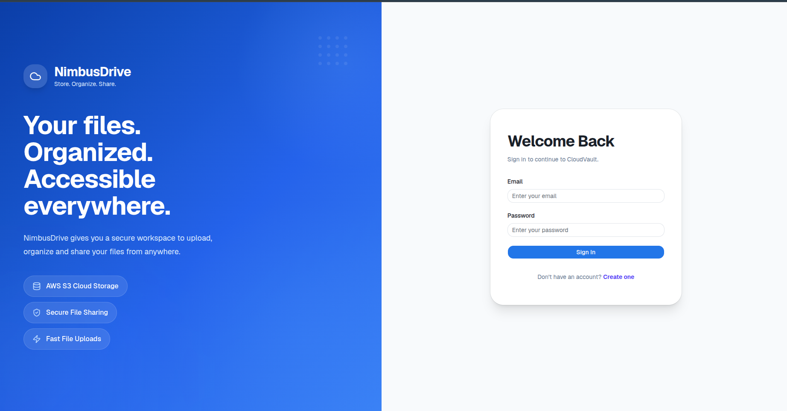
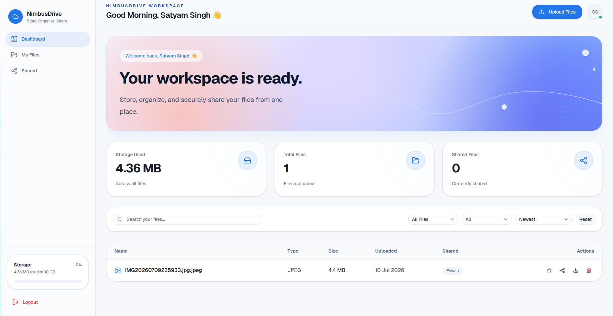
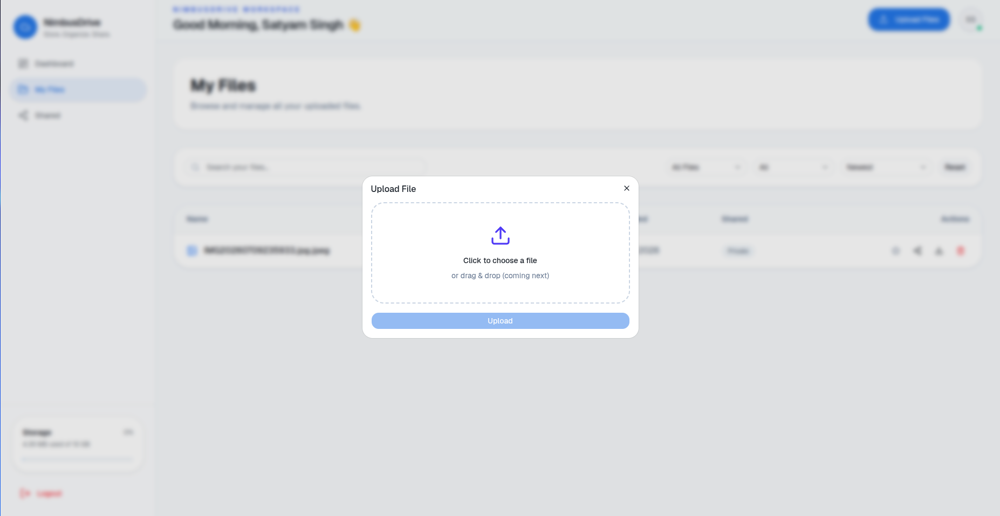
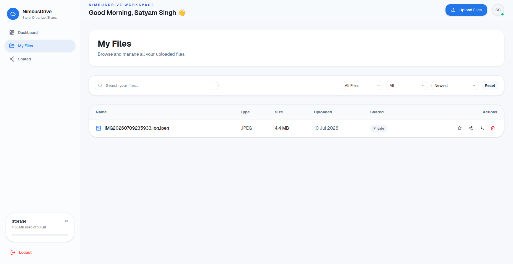
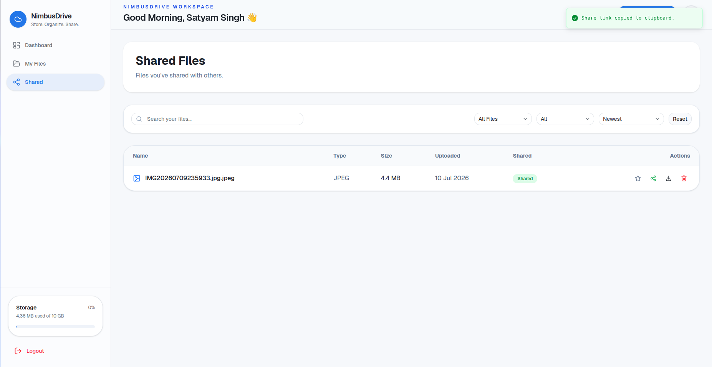
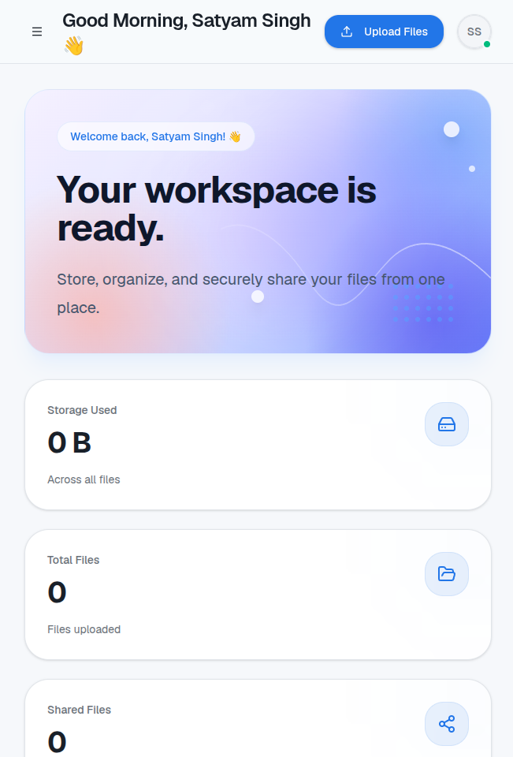

# ☁️ NimbusDrive

A modern cloud storage platform built with the MERN Stack that allows users to securely upload, organize, download, and share files from anywhere.

NimbusDrive combines a clean, modern interface with secure cloud storage powered by AWS S3, making file management simple, fast, and reliable.

---

## 🚀 Live Demo

### Frontend

https://nimbus-drive-rho.vercel.app/

### Backend API

https://nimbusdrive-api.onrender.com

---

# 📸 Screenshots

## Login Page



---

## Dashboard



---

## Upload Files



---

## My Files



---

## Shared Files



---

## Mobile Responsive



---

# ✨ Features

## 🔐 Authentication

- User Registration & Login
- JWT Authentication
- Protected Routes
- Persistent User Sessions
- Logout Confirmation Dialog
- Form Validation using React Hook Form + Zod

---

## ☁️ File Management

- Upload files to AWS S3
- Download files securely
- Delete uploaded files
- View uploaded files
- Storage Usage Tracker
- File Type Detection
- Dynamic Dashboard Statistics

---

## 🔗 File Sharing

- Share files instantly
- Disable shared links
- Public shareable URLs
- Share status indicator

---

## 🔍 Search & Filtering

- Search files by name
- Filter by file type
- Filter Shared / Private files
- Sort files by
  - Newest
  - Oldest
  - Largest
  - Smallest
  - Name (A-Z)

---

## 🎨 Modern UI

- Premium Dashboard Design
- Fully Responsive Layout
- Mobile Navigation Drawer
- Loading Skeletons
- Empty States
- Confirmation Dialogs
- Toast Notifications
- Clean Light Theme
- Modern Card-Based Interface

---

# 🛠 Tech Stack

## Frontend

- React
- TypeScript
- Vite
- Tailwind CSS v4
- Shadcn UI
- React Router DOM
- TanStack Query
- Zustand
- Axios
- React Hook Form
- Zod
- Lucide React
- Sonner

---

## Backend

- Node.js
- Express.js
- TypeScript
- MongoDB Atlas
- Mongoose
- JWT Authentication
- Multer

---

## Cloud Services

- AWS S3
- MongoDB Atlas
- Render
- Vercel

---

# 📂 Project Structure

```text
NimbusDrive
│
├── client
│   ├── components
│   ├── pages
│   ├── hooks
│   ├── services
│   ├── store
│   ├── layouts
│   └── assets
│
├── server
│   ├── config
│   ├── controllers
│   ├── middleware
│   ├── models
│   ├── routes
│   ├── services
│   ├── utils
│   └── src
│
└── screenshots
```

---

# ⚙️ Installation

## Clone Repository

```bash
git clone https://github.com/singhsatyam-dev/NimbusDrive

cd NimbusDrive
```

---

## Backend Setup

```bash
cd server

npm install

npm run dev
```

---

## Frontend Setup

```bash
cd client

npm install

npm run dev
```

---

# 🔐 Environment Variables

## Backend (.env)

```env
PORT=

MONGODB_URI=

JWT_SECRET=

AWS_REGION=

AWS_ACCESS_KEY_ID=

AWS_SECRET_ACCESS_KEY=

AWS_BUCKET_NAME=

BASE_URL=

CLIENT_URL=
```

---

## Frontend (.env)

```env
VITE_API_URL=
```

---

# 🏗 System Architecture

```text
                React + TypeScript
                     (Vercel)
                         │
                         │
                         ▼
               Express.js REST API
                    (Render)
                         │
        ┌────────────────┴───────────────┐
        │                                │
        ▼                                ▼
 MongoDB Atlas                    AWS S3 Storage
```

---

# 🌟 Highlights

- Secure cloud storage powered by AWS S3
- JWT-based authentication
- Responsive dashboard
- File upload & download
- Secure file sharing
- Modern UI redesign
- Production deployment using Vercel & Render
- Built using TypeScript across frontend and backend

---

# 🚀 Future Improvements

- 📁 Folder Management
- 🖼 File Preview
- 📤 Drag & Drop Upload
- 📦 Multi-file Upload
- 👤 User Profile Settings
- 📊 Storage Analytics
- 🌙 Dark Mode

---

# 👨‍💻 Author

**Satyam Kumar Singh**

GitHub:
https://github.com/singhsatyam-dev

LinkedIn:
https://www.linkedin.com/in/satyam-kumar-singh-25087b291

---

## ⭐ Support

If you found this project helpful, consider giving it a **Star ⭐** on GitHub.
